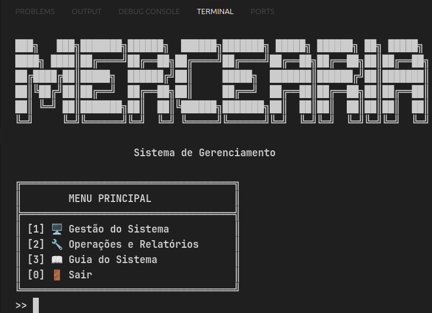
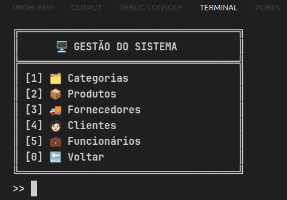
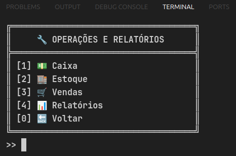
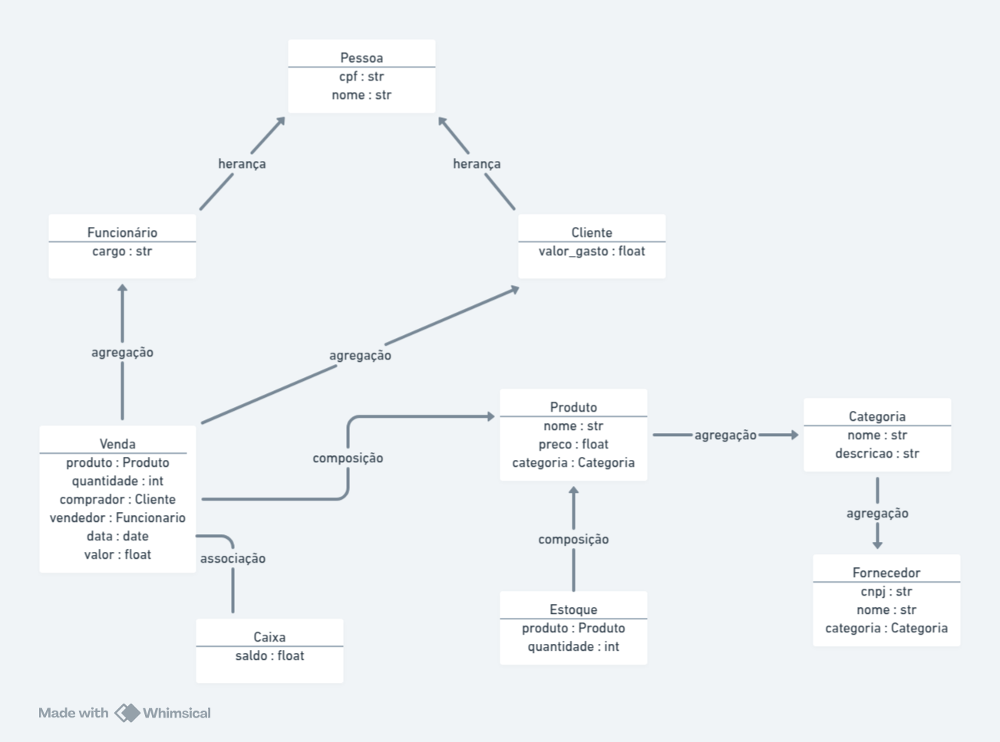

# 🏪 Sistema de Gerenciamento de Mercearia

Um sistema completo para gerenciamento de mercearias, desenvolvido em Python, que permite o controle de vendas, estoque, clientes, funcionários e muito mais.

## 📋 Funcionalidades

### 🖥️ Gestão do Sistema
- **Categorias**: Cadastro e gerenciamento de categorias de produtos
- **Produtos**: Controle completo do catálogo de produtos
- **Fornecedores**: Gestão de fornecedores por categoria
- **Clientes**: Cadastro e acompanhamento de clientes
- **Funcionários**: Gerenciamento da equipe de trabalho

### 🔧 Operações e Relatórios
- **Caixa**: Controle financeiro com operações de depósito e saque
- **Estoque**: Gestão de entrada e saída de produtos
- **Vendas**: Registro e acompanhamento de vendas
- **Relatórios**: 
  - Relatório geral
  - Vendas por período
  - Produtos mais vendidos
  - Clientes que mais compraram
  - Relatório diário

## 🛠️ Tecnologias Utilizadas

- Python 3.12.3
- Simple Terminal Menu (interface de usuário)
- JSON (armazenamento de dados)

## 📦 Instalação

1. Clone o repositório:
```bash
git clone https://github.com/andreLopes41/Mercearia
```

2. Instale as dependências:
```bash
pip install -r requirements.txt
```

3. Execute o sistema:
```bash
python view/main.py
```

## 🎯 Estrutura do Projeto

```
sistema-mercearia/
├── controller/         # Controladores 
│   ├── categoria_controller.py
│   ├── cliente_controller.py
│   ├── fornecedor_controller.py
│   ├── funcionario_controller.py
│   ├── produto_controller.py
│   ├── venda_controller.py
│   ├── estoque_controller.py
│   └── caixa_controller.py
├── model/             # Classes e modelos de dados
│   ├── Categoria.py
│   ├── Cliente.py
│   ├── Fornecedor.py
│   ├── Funcionario.py
│   ├── Pessoa.py
│   ├── Produto.py
│   ├── Venda.py
│   ├── Estoque.py
│   └── Caixa.py
├── repository/        # Camada de persistência de dados
│   ├── categoria_repository.py
│   ├── cliente_repository.py
│   ├── fornecedor_repository.py
│   ├── funcionario_repository.py
│   ├── produto_repository.py
│   ├── venda_repository.py
│   ├── estoque_repository.py
│   └── caixa_repository.py
├── view/             # Interface do usuário
│   └── main.py      # Ponto de entrada da aplicação
├── json/            # Armazenamento de dados em arquivos JSON
│   ├── categoria.json
│   ├── cliente.json
│   ├── fornecedor.json
│   ├── funcionario.json
│   ├── produto.json
│   ├── venda.json
│   ├── estoque.json
│   └── caixa.json
├── requirements.txt  # Dependências do projeto
└── README.md        # Documentação
```

### 📁 Descrição dos Diretórios

#### Controller
Contém a lógica de negócio da aplicação, fazendo a ponte entre os modelos e a interface do usuário.

#### Model
Define as classes e estruturas de dados utilizadas no sistema, implementando o padrão MVC.

#### Repository
Responsável pela persistência dos dados, implementando operações CRUD para cada entidade.

#### View
Interface do usuário em modo texto, utilizando o terminal para interação.

#### JSON
Armazena os dados da aplicação em arquivos JSON, simulando um banco de dados.

## 🔄 Padrões de Projeto Utilizados

- **MVC (Model-View-Controller)**: Separa a aplicação em três camadas distintas
- **Repository Pattern**: Abstrai a camada de persistência de dados
- **Singleton**: Utilizado nos repositórios para garantir única instância
- **Herança**: Implementada nas classes Cliente e Funcionário que herdam de Pessoa

## 🔒 Regras de Negócio

1. **Vendas**
   - Só podem ser realizadas se houver estoque suficiente
   - Atualizam automaticamente o saldo do cliente
   - Geram movimentação no caixa
   - Registram data e hora da transação

2. **Estoque**
   - Controle automático de entrada e saída
   - Validação de quantidade mínima
   - Registro de todas as movimentações

3. **Clientes**
   - CPF único e validado
   - Histórico de compras
   - Controle de valor total gasto

4. **Funcionários**
   - CPF único e validado
   - Registro de vendas realizadas
   - Controle de cargo

5. **Fornecedores**
   - CNPJ único e validado
   - Vinculação com categorias específicas
   - Registro de fornecimentos

## 🔍 Funcionalidades Principais

### Gestão de Vendas
```python
def realizar_venda(self, produto, quantidade, comprador, vendedor):
    # Validações
    # Atualização de estoque
    # Registro da venda
    # Atualização do caixa
```

### Controle de Estoque
```python
def baixar_estoque(self, produto, quantidade):
    # Validação de disponibilidade
    # Atualização da quantidade
    # Registro da movimentação
```

### Relatórios
```python
def gerar_relatorio_vendas_diario(self, data):
    # Filtragem por data
    # Cálculo de totais
    # Agrupamento de informações
```

## 🖼️ Interface do Sistema

### Menu Principal



### Gestão do Sistema


### Operações e Relatórios


## 📊 Diagrama

### Diagrama de Classes



